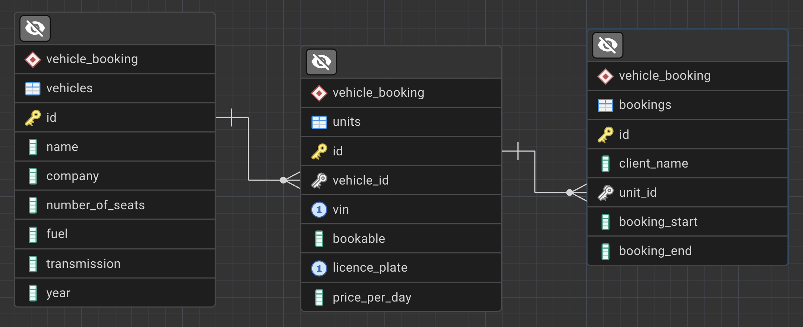

# VehicleBooking
1. [Projekti kirjeldus](#projekti-kirjeldus)
2. [Arhitektuur](#arhitektuur)
3. [Käivitusjuhised](#käivitusjuhised)
4. [Andmebaasi skeem](#andmebaasi-skeem)
5. [Edasiarenduse võimalused](#edasiarenduse-võimalused)

## Projekti kirjeldus
Projekt *VehicleBooking* võimaldab hallata broneeritavaid sõidukeid. 
Andmebaas: Postgres
Back-end: Java Spring
Front-end: Angular

## Arhitektuur
### Andmebaas
Andmebaasiks on postgres. Andmebaasi skeem on flyway migratsiooni läbi versioonihalduses.  
Andmebaas on disainitud võimalikult piiravalt - olemas on ainult need veerud, mida kohe vaja on. Kui mõistlik, on veergudel peal piirangud (*constraint*).

### Back-end
- *model* klass ühendab Java objekti andmebaasi tabeliga. Kasutusel on jakarta.persistence annotatsioonid. 
- *repository* klass annab *service* klassile API andmebaasi päringute tegemiseks (kõik CRUD tüüpi päringud). 
- *service* klass ühendab omavahel *controller* ja *repository* klassi ja sisaldab andmekäsitlusloogikat, kui seda vaja on. 
- *controller* klass loob ühenduse REST API-ga.
- *GlobalExceptionHandler* käsitleb vigu ning tagastab sobiva teatega HTTP staatuse.
- *VehicleBookingApplication* paneb rakenduse käima.

### Front-end
Ei ole veel teinud. TODO!

## Käivitusjuhised
1. Veendu, et sinu Postgresi server töötab.
2. Loo andmebaas nimega `vehicle_booking`: `CREATE DATABASE vehicle_booking;`.
3. Muuda failis [application.properties](backend/src/main/resources/application.properties) vajadusel `spring.datasource` muutujaid.
4. Käivitamine:
   - **IDE**: ava fail [VehicleBookingApplication.java](backend/src/main/java/ee/vehicleBooking/vehicleBooking/VehicleBookingApplication.java) ja vajuta "Run".
   - **Käsurida (CLI)**: `./mvnw spring-boot:run`

### API testimine
API access point: http://localhost:8080/api
Alguses API testimiseks järgi seda nimekirja:
- GET http://localhost:8080/api/vehicles - vastus peaks olema `[]` (200 OK)
- POST http://localhost:8080/api/vehicles, body `{}` - vastuses peaks olema nimekiri kõikidest erroritest kehas (400 Bad Request)
- POST http://localhost:8080/api/vehicles, body:
```
{
    "company": "Ford",
    "name": "F150",
    "numberOfSeats": 2,
    "fuel": "diesel",
    "transmission": "manual",
    "year": 1990
}
```
vastuseks peaks olema loodud objekt (201 Created)
- GET http://localhost:8080/api/vehicles - vastus peaks olema list ühe elemendiga - äsja loodud objektiga (200 OK)
- DELETE http://localhost:8080/api/vehicles/1 - vastus peaks olema (204 No Content)
- GET http://localhost:8080/api/vehicles - vastus peaks olema `[]` (200 OK)

## Andmebaasi skeem


## Edasiarenduse võimalused
- Suurem testide katvus
- Autentimine
- Läbimõeldud logimine
- Booking tabelisse veerg `next_booking_start`